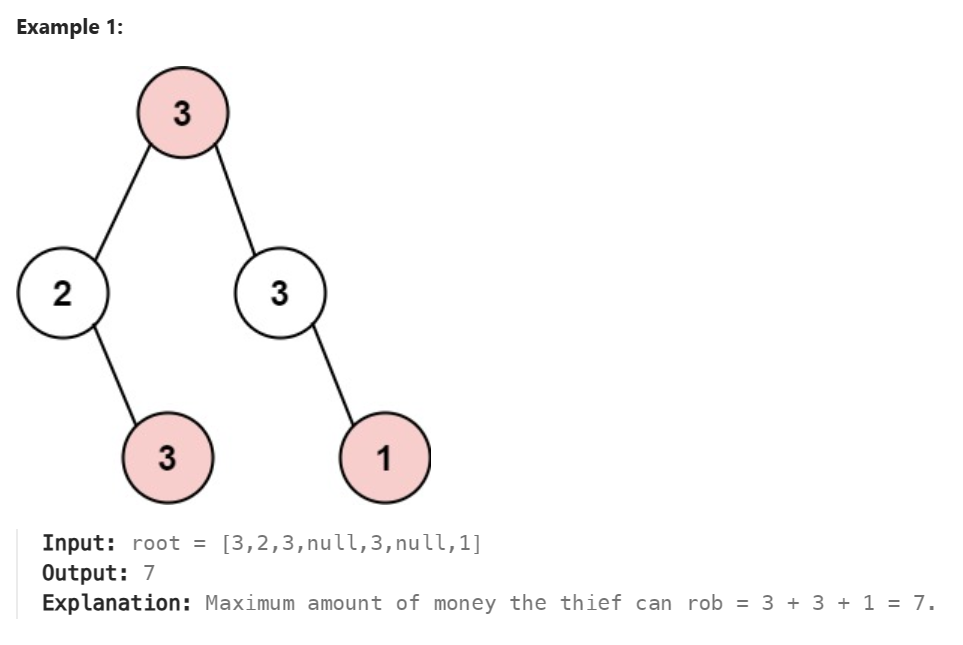

# 1-D Dynamic Programming

https://www.zhihu.com/question/23995189
- 用**历史数据**来计算（**可以是一维或多维**），如：dp[n] = dp[n-1] + dp[n-2]，这个也是动态规划的难点，找出**他们之间的关系**

- 把大问题分成小的问题（最优子结构）
  - 初值问题（拆分到一定程度就需要一个特定的值例如：dp[3] = dp[2] + dp[1]），在这里2和1为初值

解题步骤
1. 定义数组元素的含义
2. 找出数组元素之间的关系式
3. 初始值

# 70 Climbing Stairs
>假设你正在爬楼梯。需要 n 阶你才能到达楼顶。
每次你可以爬 1 或 2 个台阶。你有多少种不同的方法可以爬到楼顶呢？


1. 判断结束条件， 分别为n=0, n=1和n=2，然后找出后一个与前面的关系
2. 我这边`one.js`使用了很笨的方法，使用递归，所以每次运行是从最大的找，这样子根本不会用到之前的数据，这点注意，有些问题就不是使用递归的了，虽然能够解，但是时间超出。
   1. Update：改了一点，避免重复计算，最后通过实践一样
    ```js
    if(dp[n] !== undefined){
            return dp[n]
        }
    ```
3. 总结可以从**n最高**开始算或从**最低**开始算

# 198 House Robber
>你是一个专业的小偷，计划偷窃沿街的房屋。每间房内都藏有一定的现金，影响你偷窃的唯一制约因素就是相邻的房屋装有相互连通的防盗系统，如果两间相邻的房屋在同一晚上被小偷闯入，系统会自动报警。
给定一个代表每个房屋存放金额的非负整数数组，计算你 不触动警报装置的情况下 ，一夜之内能够偷窃到的最高金额。


这一题不会太难，画个图片给自己以后理解吧~


然后做了优化就是重复使用的值就利用预定好的吧
```js
let numlength = nums.length
```

**提升很大！！！**

# 213 House Robber II
>你是一个专业的小偷，计划偷窃沿街的房屋，每间房内都藏有一定的现金。这个地方所有的房屋都 围成一圈 ，这意味着第一个房屋和最后一个房屋是紧挨着的。同时，相邻的房屋装有相互连通的防盗系统，如果两间相邻的房屋在同一晚上被小偷闯入，系统会自动报警 。
给定一个代表每个房屋存放金额的非负整数数组，计算你 在不触动警报装置的情况下 ，今晚能够偷窃到的最高金额。


# 开始C#

# 337 House Robber III（动态+深度搜索）
>The thief has found himself a new place for his thievery again. There is only one entrance to this area, called root.
Besides the root, each house has one and only one parent house. After a tour, the smart thief realized that all houses in this place form a binary tree. It will automatically contact the police if two directly-linked houses were broken into on the same night.
Given the root of the binary tree, return the maximum amount of money the thief can rob without alerting the police.


这个题目！就是昨天`2023/12/6`做的[2646. Minimize the Total Price of the Trips
](https://leetcode.cn/problems/minimize-the-total-price-of-the-trips/description/?envType=daily-question&envId=2023-12-06)的简单版本，其中重要理解的就是取或不取当前节点。

看这个图就显而易见乐，分为两个情况
1. 取自己
2. 不取自己
过后就是**动态规划**了，看了下面代码就很容易理解了
```cs
    public int Rob(TreeNode root)
    {
        Tuple<int, int> myTuple = PostOrder(root);
        return Math.Max(myTuple.Item1, myTuple.Item2);
    }

    public Tuple<int,int> PostOrder(TreeNode node)
    {
        
        if (node == null)
        {
            return new Tuple<int, int>(0,0);
        }

        Tuple<int,int> left = PostOrder(node.left);
        Tuple<int, int> right = PostOrder(node.right);

        return new Tuple<int, int>((node.val + left.Item2 + right.Item2),
            (Math.Max(left.Item1, left.Item2)) + Math.Max(right.Item1, right.Item2));

    }
```