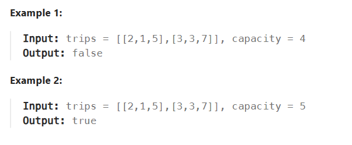

# Array & Hashing

# 2661 First Completely Painted Row or Column
>You are given a 0-indexed integer array arr, and an m x n integer matrix mat. arr and mat both contain all the integers in the range [1, m * n].
Go through each index i in arr starting from index 0 and paint the cell in mat containing the integer arr[i].
Return the smallest index i at which either a row or a column will be completely painted in mat.


比较简单，用map保存每个节点，然后用两个数组保存当前行/列的长度

# 1094. Car Pooling
>There is a car with capacity empty seats. The vehicle only drives east (i.e., it cannot turn around and drive west).
You are given the integer capacity and an array trips where trips[i] = [numPassengersi, fromi, toi] indicates that the ith trip has numPassengersi passengers and the locations to pick them up and drop them off are fromi and toi respectively. The locations are given as the number of kilometers due east from the car's initial location.
Return true if it is possible to pick up and drop off all passengers for all the given trips, or false otherwise.


也是简单的题目，只需要利用map来存index的上下人数就可以了，注意就是会同时有几个不同的车再同一个时间点上下，所以需要更新map里面的内容。

 题解是差分数组HackerRank Array Manipulation
 - 看了以下，好像也没有差别，但是他是在一开始就创建数组。
```js
var carPooling = function(trips, capacity) {
    let to_max = 0;
    for (const trip of trips) {
        to_max = Math.max(to_max, trip[2]);
    }

    const diff = new Array(to_max + 1).fill(0);
    for (const trip of trips) {
        diff[trip[1]] += trip[0];
        diff[trip[2]] -= trip[0];
    }

    let count = 0;
    for (let i = 0; i <= to_max; ++i) {
        count += diff[i];
        if (count > capacity) {
            return false;
        }
    }
    return true;
};

作者：力扣官方题解
链接：https://leetcode.cn/problems/car-pooling/solutions/2546591/pin-che-by-leetcode-solution-scp6/
来源：力扣（LeetCode）
著作权归作者所有。商业转载请联系作者获得授权，非商业转载请注明出处。
```