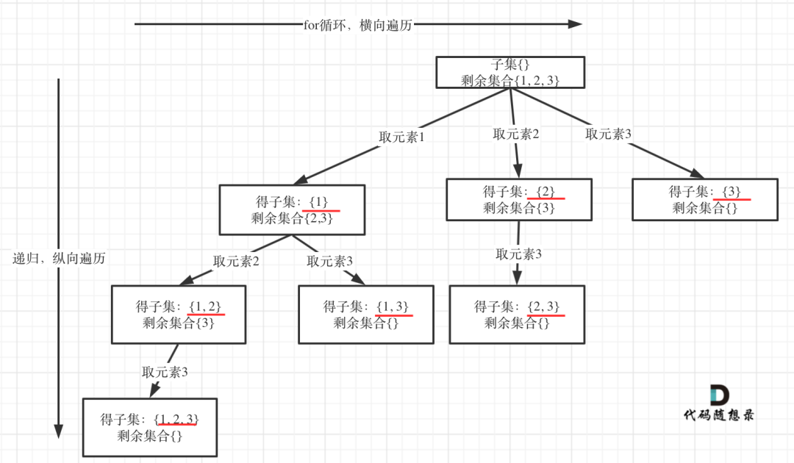
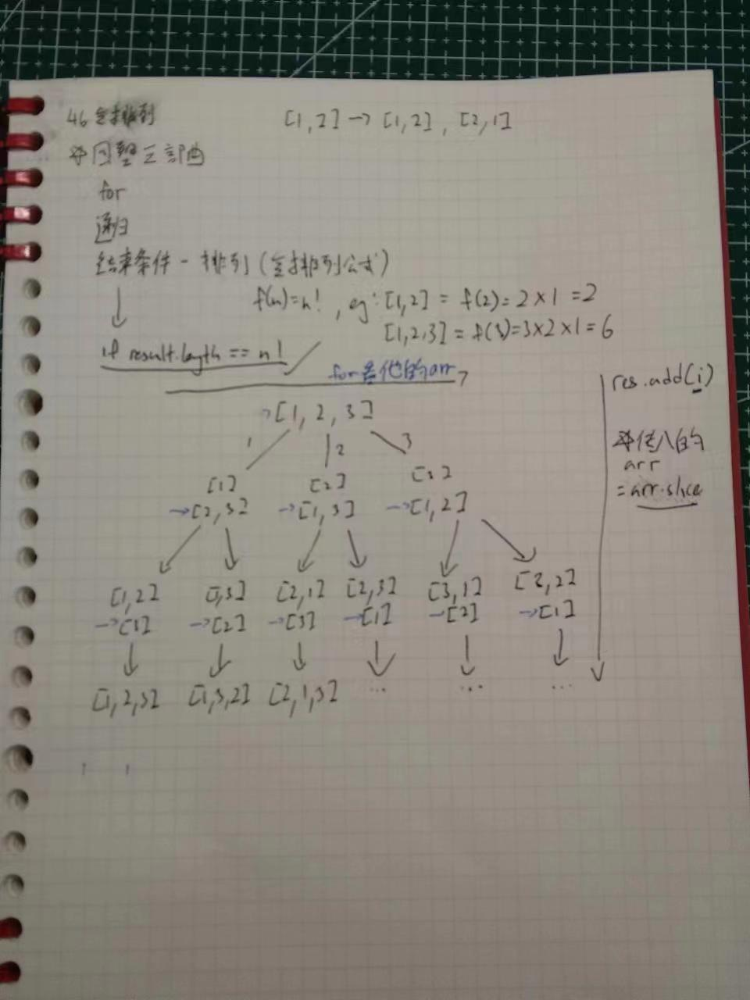
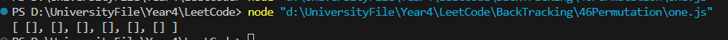
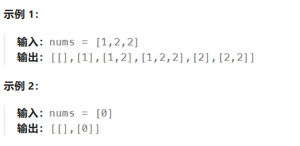
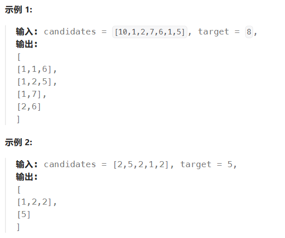
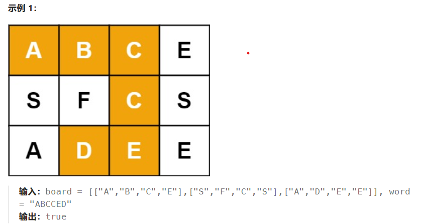
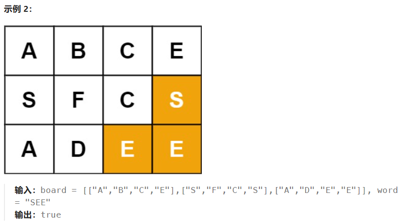
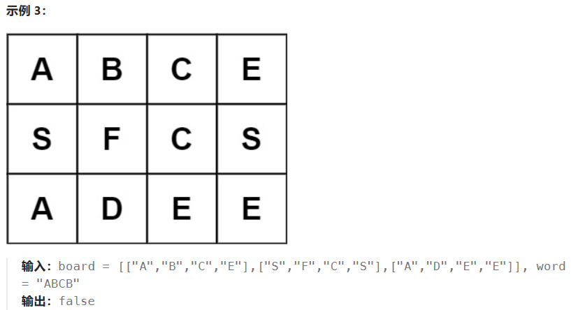
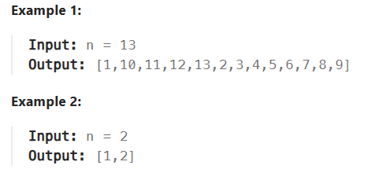

# BackTracking
- it's a searching algorithm
- 穷举法来的
- for problems that have set of choices to make, and wanted to try out different combination to see what works
- it's especially good for solving puzzles, finding path 
- if it doesnt meet condition, it "backtrack" to previous node and try out other choices.

For problems that doesnt have better solution
1. 组合问题 - N个数里按一定规则找出k个数的集合
2. 排列问题 - N个数按一定规则全排列，有几种排列方式
3. 切割问题 - 一个字符串按一定规则有几种切割方式
4. 子集问题 - 一个N个数的集合里有多少复合条件的子集（**找出树的所有节点**）
5. 棋盘问题 - N皇后，解数独等等

**组合无序，排列有序，就可以了**


# 78 Subset
对于这一题，因为他要找所有集合（并且是**组合**，不要求有序）
所以要想获取树上的所有节点。

Key takeaway
- 对于可以使用回溯的题目都可以想象成一颗树，并且用递归去实现
- 对于树，他的广度就是集合的大小，他的深度就是递归的深度

```js
function backtrack(nums, startIndex,path,result){
    // let ref = path.slice()
    result.push(path.slice())

    if(startIndex>=nums.length){
        return
    }

    for(let i=startIndex;i<=nums.length-1;i++){
        path.push(nums[i])
        backtrack(nums,i+1,path,result)
        path.pop()
    }
}
```

# 39 Combination Sum
>给你一个 无重复元素 的整数数组 candidates 和一个目标整数 target ，找出 candidates 中可以使数字和为目标数 target 
的 所有 不同组合 ，并以列表形式返回。你可以按 任意顺序 返回这些组合。
candidates 中的 同一个 数字可以 无限制重复被选取 。如果至少一个数字的被选数量不同，则两种组合是不同的。 
对于给定的输入，保证和为 target 的不同组合数少于 150 个。

>示例 1：
输入：candidates = [2,3,6,7], target = 7
输出：[[2,2,3],[7]]
解释：
2 和 3 可以形成一组候选，2 + 2 + 3 = 7 。注意 2 可以使用多次。
7 也是一个候选， 7 = 7 。
仅有这两种组合。

>示例 2：
输入: candidates = [2,3,5], target = 8
输出: [[2,2,2,2],[2,3,3],[3,5]]

>示例 3：
输入: candidates = [2], target = 1
输出: []

- 题目解法与上题类似，需要设定停止目标（sum>target）(sum===target)
- 然后设定for循环，这里是重点，对于一层，他的candidates会减少，为了不与前一个的冲突
- 然后递归进行
- 这里的**裁剪方式**就是如果>或者=的时候就不去判断后面的了，提高效率

```js
var combinationSum = function(candidates, target) {
    let result = new Array()
    let path = new Array()

    candidates.sort((a,b)=> a-b)

    backtrack(candidates,target,result,path)

    console.log(result)
    return result
};

function backtrack(candidates,target,result,path){


    if(getArraySum(path)>target){
        canSkip = true
        return
    }

    if(getArraySum(path) === target){
        canSkip = true
        result.push(path.slice())
        return
    }

    for(let i = 0; i<candidates.length;i++){
        path.push(candidates[i])
        candidateCur = candidates.slice(i)
        backtrack(candidateCur,target,result,path)
        path.pop()
       if(canSkip){
            canSkip = false
            break
        }
    }

}
```

另外一个方法为**判断树**
- 左边包含，右边不包含，卧槽
```js

dfs(startIndex, path, sum){
    if(sum == target){
    res.push(path.slice())
    return
    }

    if(sum > target || startIndex >= lengthOfArr){
        return 
    }

    path.push(arr[startIndex])

    //left
    dfs(startIndex, path, sum + arr[startIndex])
    path.pop()

    //right
    //not adding to the sum
    dfs(startIndex+1, path, sum)
}

```


# 46 Permutation 全排列
>给定一个不含重复数字的数组 nums ，返回其 所有可能的全排列 。你可以 按任意顺序 返回答案。
示例 1：
输入：nums = [1,2,3]
输出：[[[1,2,3],[1,3,2],[2,1,3],[2,3,1],[3,1,2],[3,2,1]]]
示例 2：
输入：nums = [0,1]
输出：[[[0,1],[1,0]]]
示例 3：
输入：nums = [1]
输出：[[[1]]]

也是画图就可以解决了


一些重要的js语法，以免以后再次出错
- 这里可以想我们的`path`是一个对象，所以才会再结果一直返回空的数组
```js
if(path.length == length){
            result.push(path.slice()) //这里返回一个新的实例，不然再调用的时候会更改原有的path
            return
        }
```


# 90 Subset II 子集
- 子集：不要求顺序

>给你一个整数数组 nums ，其中可能包含重复元素，请你返回该数组所有可能的子集（幂集）。
解集 不能 包含重复的子集。返回的解集中，子集可以按 任意顺序 排列


想法：
1. 对于回溯的每一层（for循环），我们可以利用set来保存是否已经有该数了，如果有则跳过当前的执行
2. 对于结束情况就是for循环没有数值为止（这里记得js传递数组的原理（引用类型，所以要传递一个值类型））
3. 全局变量，path和result，同样的
 
# 40 Combination sum II
>给定一个候选人编号的集合 candidates 和一个目标数 target ，找出 candidates 中所有可以使数字和为 target 的组合。
candidates 中的每个数字在每个组合中只能使用 一次 。
注意：解集不能包含重复的组合。


与昨天做的`SubSetII`类似，可以比较是否与前面相同，如果一样则不添加进去。
如： [1,1,1,2,3,5,6]
对于第一个循环，因为1已经有了，所以在同样层数的循环不再以1作为头

```js
for(i; i<length;i++)
        {
            //跳过重复的
            if(candidates[i] == prev){
                continue
            }
            path.push(candidates[i])
            backtrack(path, i+1, sum + candidates[i])
            path.pop()

            prev = candidates[i]
            
        }
```


# 79 Word Search
>给定一个 m x n 二维字符网格 board 和一个字符串单词 word 。如果 word 存在于网格中，返回 true ；否则，返回 false 。
单词必须按照字母顺序，通过相邻的单元格内的字母构成，其中“相邻”单元格是那些水平相邻或垂直相邻的单元格。同一个单元格内的字母不允许被重复使用。




各个变量
```js
i = 0 //当前位置
r = 0 //当前row
c = 0 //当前col
let mySet = new Set() //保存走过路径
```

1. 返回正确指标
```js
i == word.length
```

2. 返回错误指标
```js
r<0
r>=board.length
c<0
r>=board[0].length

mySet.has((r,c))
board[r][c] !== word[i]
```

3. 递归
```js
mySet.add((r,c))

let result = (递归)上|下|左|右

mySet.remove((r,c))
```

4. 返回最终结果
```js
return result
```

# 386 Lexicographical Numbers
>Given an integer n, return all the numbers in the range [1, n] sorted in lexicographical order.
You must write an algorithm that runs in O(n) time and uses O(1) extra space. 


can use recursive, it's nice the code, but time is longer than traversing and finding pattern
`one.js` uses recursive
`two.js` uses traversing