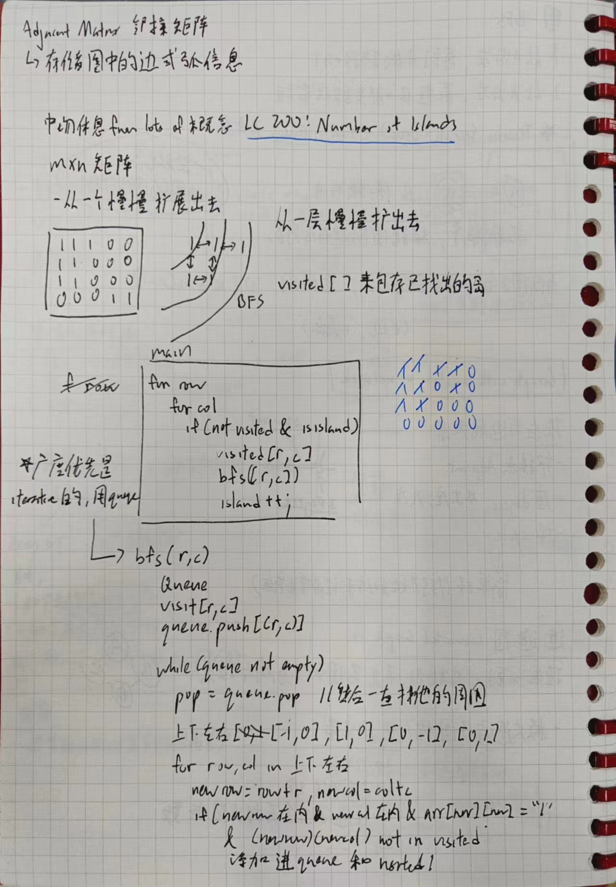
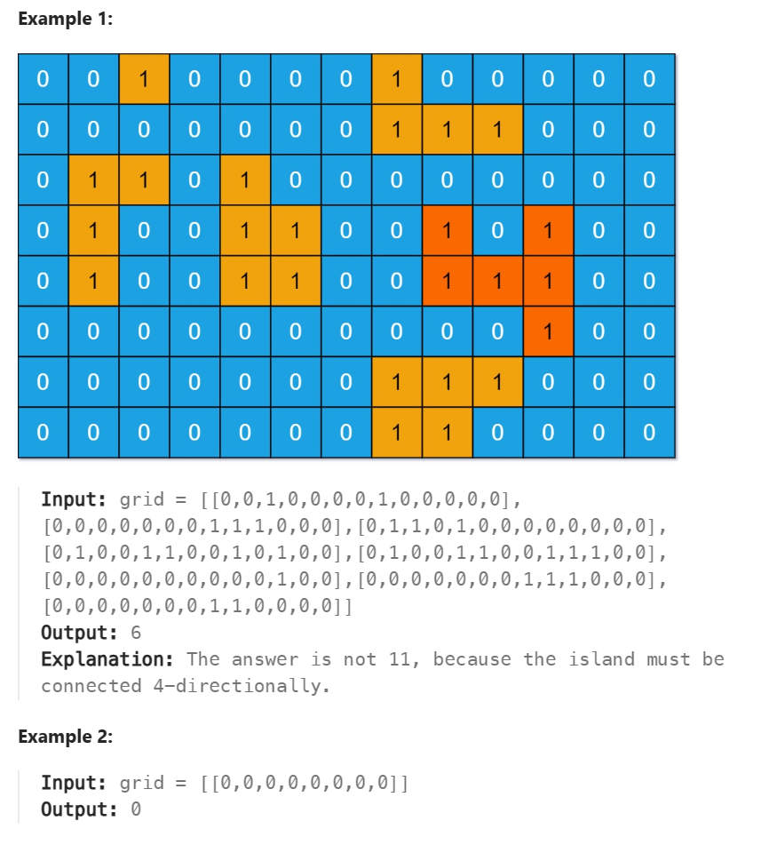
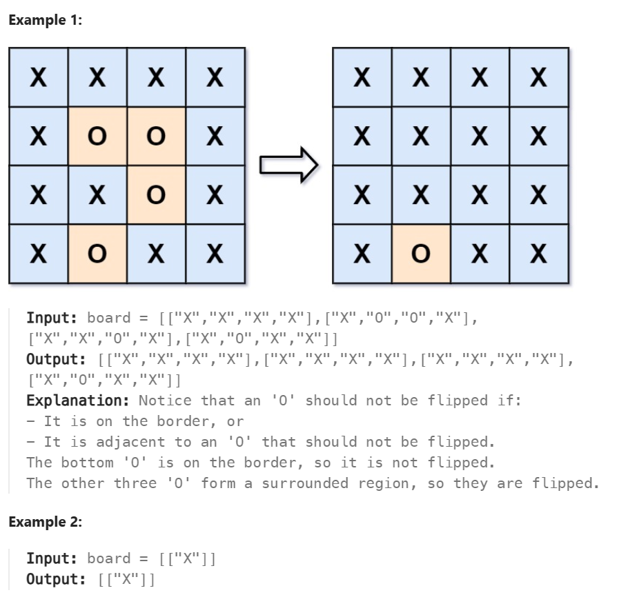
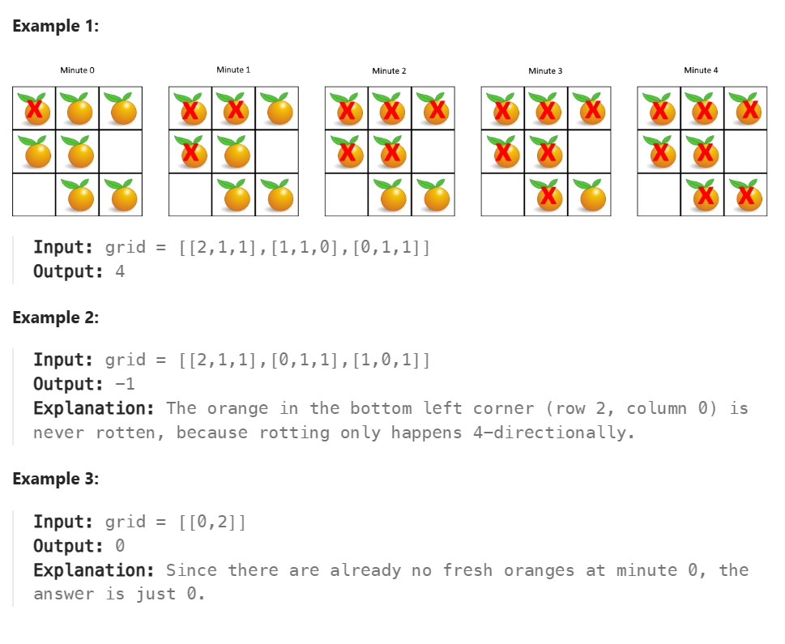
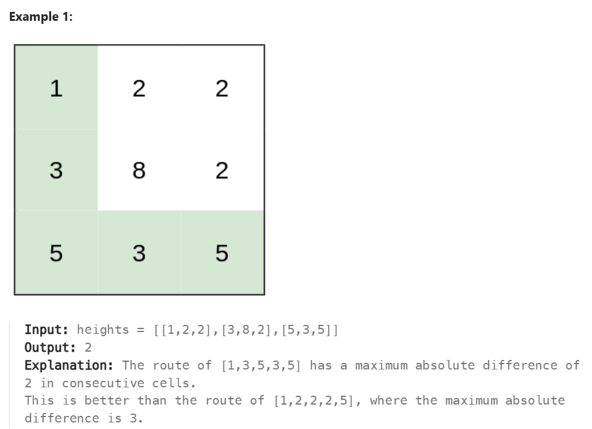

# Graph
概念
1. 层次遍历（队列实现）
2. 有向图，无向图
3. 邻接点 adjacent
4. 度 degree - 一个节点与其他节点连接的数量
5. 环 cycle - 出度和入度一眼
6. 连通图 Connected Graph - 所有节点之间都有**路径**可以抵达对方

# 200 Number of island
>Given an m x n 2D binary grid grid which represents a map of '1's (land) and '0's (water), return the number of islands.
An island is surrounded by water and is formed by connecting adjacent lands horizontally or vertically. You may assume all four edges of the grid are all surrounded by water.

>Example 1:
Input: grid = [
  ["1","1","1","1","0"],
  ["1","1","0","1","0"],
  ["1","1","0","0","0"],
  ["0","0","0","0","0"]
]
Output: 1
Example 2:
Input: grid = [
  ["1","1","0","0","0"],
  ["1","1","0","0","0"],
  ["0","0","1","0","0"],
  ["0","0","0","1","1"]
]
Output: 3


这一题实际上就是找图里面的**连通图**，然后利用BFS查找，标记哪里已经探索过了。
`one.js`不知道为什么过不去，利用set来标记
`two.js`利用了把"1"变成"0"

# 695 Max Area Of Island
>You are given an m x n binary matrix grid. An island is a group of 1's (representing land) connected 4-directionally (horizontal or vertical.) You may assume all four edges of the grid are surrounded by water.
The area of an island is the number of cells with a value 1 in the island.
Return the maximum area of an island in grid. If there is no island, return 0.


跟上一题应该一样把，就只是再**while里面计算max**
- 确实一样

# 417 Pacific Atlantic Water Flow
>There is an m x n rectangular island that borders both the Pacific Ocean and Atlantic Ocean. The Pacific Ocean touches the island's left and top edges, and the Atlantic Ocean touches the island's right and bottom edges.
The island is partitioned into a grid of square cells. You are given an m x n integer matrix heights where heights[r][c] represents the height above sea level of the cell at coordinate (r, c).
The island receives a lot of rain, and the rain water can flow to neighboring cells directly north, south, east, and west if the neighboring cell's height is less than or equal to the current cell's height. Water can flow from any cell adjacent to an ocean into the ocean.
Return a 2D list of grid coordinates result where result[i] = [ri, ci] denotes that rain water can flow from cell (ri, ci) to both the Pacific and Atlantic oceans.

>Example 1:
Input: heights = [[1,2,2,3,5],[3,2,3,4,4],[2,4,5,3,1],[6,7,1,4,5],[5,1,1,2,4]]
Output: [[0,4],[1,3],[1,4],[2,2],[3,0],[3,1],[4,0]]
Explanation: The following cells can flow to the Pacific and Atlantic oceans, as shown below:
[0,4]: [0,4] -> Pacific Ocean 
       [0,4] -> Atlantic Ocean
[1,3]: [1,3] -> [0,3] -> Pacific Ocean 
       [1,3] -> [1,4] -> Atlantic Ocean
[1,4]: [1,4] -> [1,3] -> [0,3] -> Pacific Ocean 
       [1,4] -> Atlantic Ocean
[2,2]: [2,2] -> [1,2] -> [0,2] -> Pacific Ocean 
       [2,2] -> [2,3] -> [2,4] -> Atlantic Ocean
[3,0]: [3,0] -> Pacific Ocean 
       [3,0] -> [4,0] -> Atlantic Ocean
[3,1]: [3,1] -> [3,0] -> Pacific Ocean 
       [3,1] -> [4,1] -> Atlantic Ocean
[4,0]: [4,0] -> Pacific Ocean 
       [4,0] -> Atlantic Ocean
Note that there are other possible paths for these cells to flow to the Pacific and Atlantic oceans.

>Input: heights = [[1]]
Output: [[0,0]]
Explanation: The water can flow from the only cell to the Pacific and Atlantic oceans.

# 130 Surrounded Region
>Given an m x n matrix board containing 'X' and 'O', capture all regions that are 4-directionally surrounded by 'X'.
A region is captured by flipping all 'O's into 'X's in that surrounded region.


Find the corner first, mark all the items that should not be chaged.
The way to search corner's connected 'O' will be using **DFS**.

```py
def dfs(r,c):
            if(r<0 or c<0 or r>= row or c>=col or board[r][c] != "O"):
                return
            
            board[r][c] = 'T'
            dfs(r+1,c)
            dfs(r-1,c)
            dfs(r,c+1)
            dfs(r,c-1)
```

# 994 Rotten Orange
>You are given an m x n grid where each cell can have one of three values:
0 representing an empty cell,
1 representing a fresh orange, or
2 representing a rotten orange.
Every minute, any fresh orange that is 4-directionally adjacent to a rotten orange becomes rotten.
Return the minimum number of minutes that must elapse until no cell has a fresh orange. If this is impossible, return -1.


应该利用BFS因为是周围算一次
- 确实是用BFS，并且也是比较是常用的，可以熟悉这个用法
- 就是记录一次过清空queue的次数，这里因为是层次的去做，所以有如下的代码

```python
while queue:
       for i in range(len(queue)):
              innerloopfunction...;

       clearedQueue+=1
```

where `clearedQueue` in here take jobs as **time**

# C#
# 1631. Path With Minimum Effort
>You are a hiker preparing for an upcoming hike. You are given heights, a 2D array of size rows x columns, where heights[row][col] represents the height of cell (row, col). You are situated in the top-left cell, (0, 0), and you hope to travel to the bottom-right cell, (rows-1, columns-1) (i.e., 0-indexed). You can move up, down, left, or right, and you wish to find a route that requires the minimum effort.
A route's effort is the maximum absolute difference in heights between two consecutive cells of the route.
Return the minimum effort required to travel from the top-left cell to the bottom-right cell.


- 这一题偏难，涉及的概念更加多
- 题目解析：因为是要找从一个点到另外一个点，也可以想象成图的连通性（是否连通）。
  - 所以使用了UnionSet来做
  - 其中UnionSet主要的函数就只有`find()`,`init()`和`union()`，分别到表找出他的Parent,初始化和将两个节点连接起来。

### UnionSet
```cs
 //Union set data structure
    public class DSU
    {
        private int[] pre;
        private int count;

        //initialize
        public DSU(int N)
        {
            count = N;
            pre = new int[N];

            //let them parent is same first
            for (var i = 0; i < N; i++)
            {
                pre[i] = i;
            }
        }
        
        //find function - (find its parent)
        //other than finding its parent, it also cut the length of him to parent
        public int find(int x)
        {
            if (x != pre[x])
            {
                pre[x] = find(pre[x]);
            }

            return pre[x];
        }
        
        //union function, in this section the parent of x will be parent of y
        public void union(int x, int y)
        {
            int parentX = find(x);
            int parentY = find(y);

            if (parentX == parentY)
            {
                return;
            }

            pre[parentX] = parentY;
            count--;
            return;
        }
        
        //connected function, check if two set is connected
        public bool connected(int x, int y)
        {
            return find(x) == find(y);
        }
        
    }
```