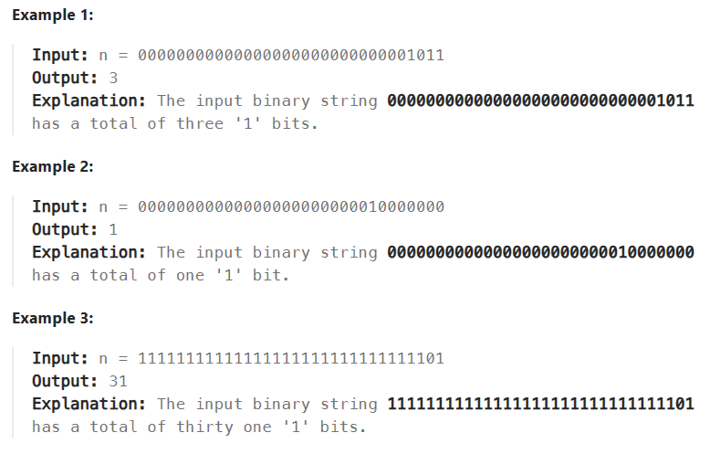

# Bit

# 136 Single Number
```js
/**
 * @param {number[]} nums
 * @return {number}
 */
var singleNumber = function(nums) {
  let ans=nums[0]
  let len = nums.length
  
  for(let i =1; i<len;i++){
      ans ^= nums[i]

  }
    
   return ans
};
```

# 191 Nubmer of 1 Bits
>Write a function that takes the binary representation of an unsigned integer and returns the number of '1' bits it has (also known as the Hamming weight).
Note:
Note that in some languages, such as Java, there is no unsigned integer type. In this case, the input will be given as a signed integer type. It should not affect your implementation, as the integer's internal binary representation is the same, whether it is signed or unsigned.
In Java, the compiler represents the signed integers using 2's complement notation. Therefore, in Example 3, the input represents the signed integer. -3.


What i need to learn
1. bit manipulation in javascript
2. change the lowest 1 bit do `&` operation

1110 - = 1100, yeahh