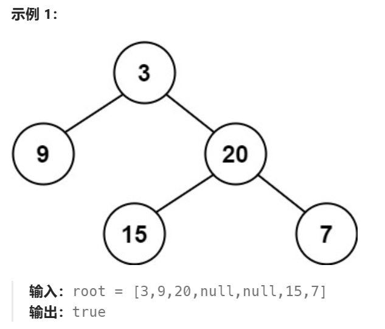
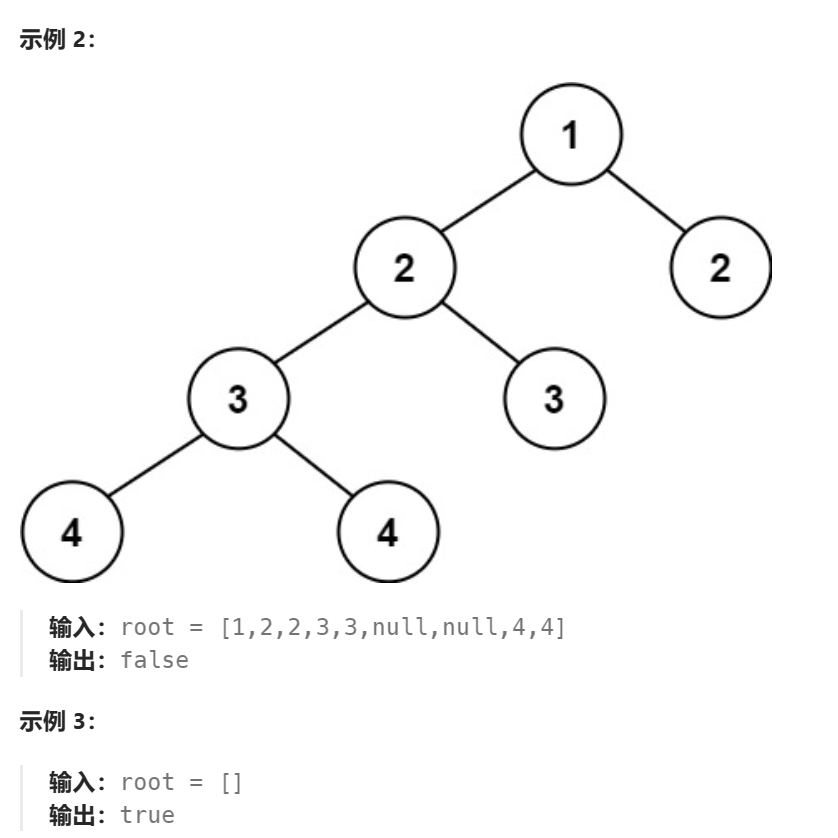
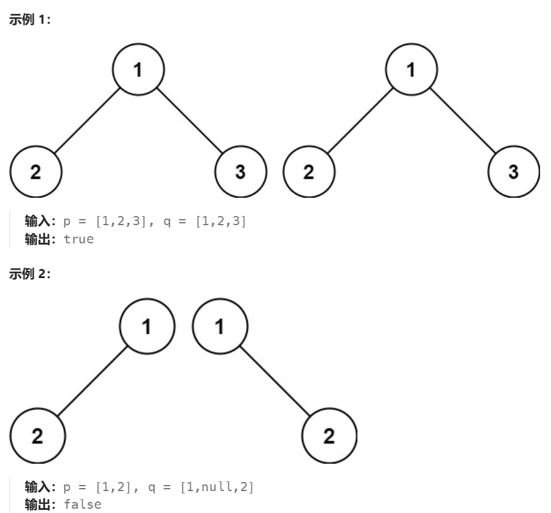
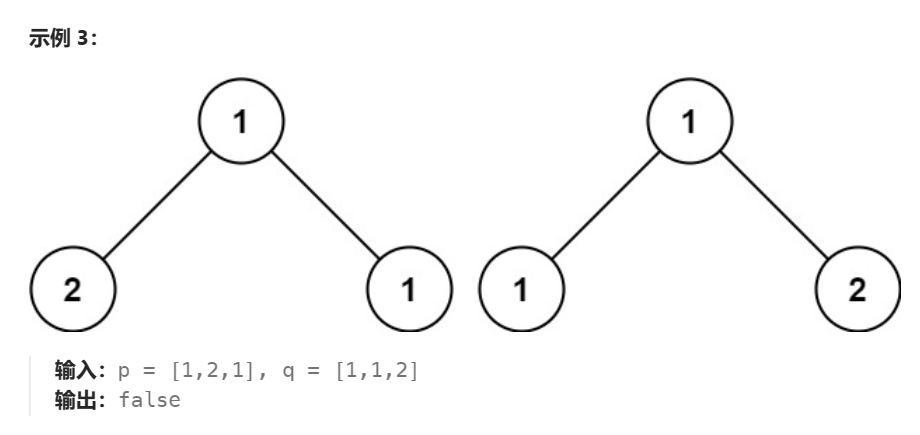
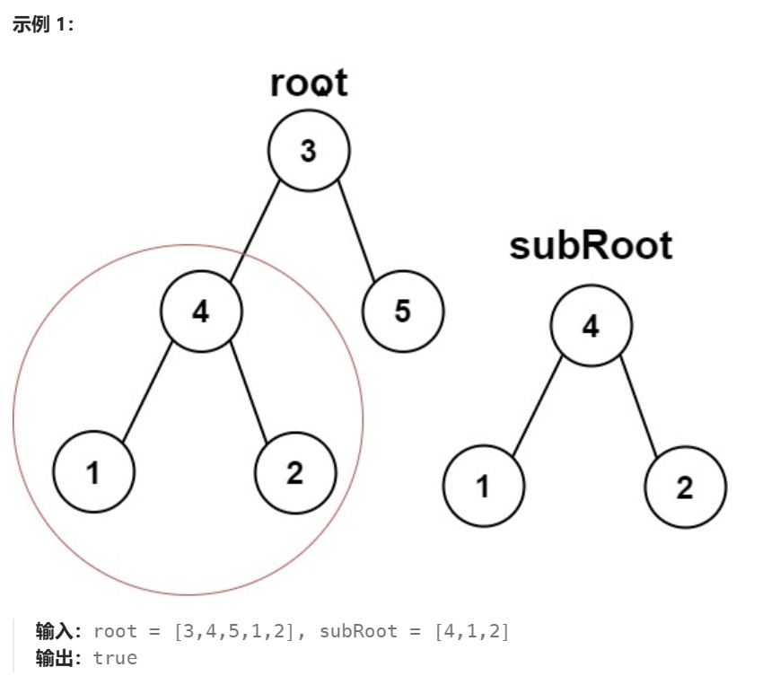
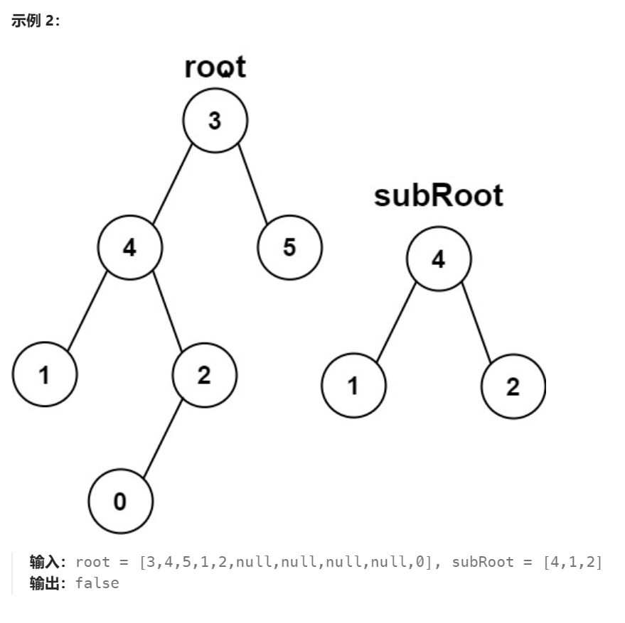

# Tree

# 110 Balanced Binary Tree
给定一个二叉树，判断它是否是高度平衡的二叉树。
本题中，一棵高度平衡二叉树定义为：

>一个二叉树每个节点 的左右两个子树的高度差的绝对值不超过 1 。



这题我首先用的方法是递归，想法确实没有问题，但是我在做递归方面需要非常理解每一次的**返回值**以及他的**终止条件**

- 对于这一题，我们为了得到是否为平衡树，其实就是需要直到**左右子树的高度差**，并且我们直到终止条件吗？有！就是当节点为`null`的时候，他的高度就为`0`，就有以下的代码

```js

function dfs(node){
    //当为叶子节点的左右节点时
    if(node == null){
        //返回树的高度
        return 0
    }

    let leftHeight = dfs(node.left)
    if(leftHeight == -1){
        return -1
    }

    let rightHeight = dfs(node.right)
    if(rightHeight == -1){
        return -1
    }


    //当左右子树的高度差小于1时
    let isNotBalanced = (Math.abs(leftHeight - rightHeight) > 1)

    if(isNotBalanced){
        return -1
    }

    return Math.max(leftHeight, rightHeight) + 1 
}

```

# 100 Same Tree
给你两棵二叉树的根节点 p 和 q ，编写一个函数来检验这两棵树是否相同。
如果两个树在结构上相同，并且节点具有相同的值，则认为它们是相同的。
>


想想终止条件
1. 就是他们的val不一样的时候就可以返回-1了
2. 还有就是当其中一个为null也是返回-1代表不同样
3. 只有当所有都通过了才是正确的

# 572 Subtree of another tree
给你两棵二叉树 root 和 subRoot 。检验 root 中是否包含和 subRoot 具有相同结构和节点值的子树。如果存在，返回 true ；否则，返回 false 。

二叉树 tree 的一棵子树包括 tree 的某个节点和这个节点的所有后代节点。tree 也可以看做它自身的一棵子树。
>

 
 Edge cases
 1. 1 null-null - true
 2. Main null - false
 3. Sub null - true

```js
function isSubTree(root,subRoot){
    if(root == null){
        return false
    }

    if(isSameTree(root,subRoot)){
        return true
    }

    return isSameTree(root.left, subRoot.left) || isSameTree(root.right, subRoot.right)
}

function isSameTree(root, subRoost){
    if(root == null && subRoot == null)
        return true;

    if(root && subRoot && root.val == subRoot.val)
        return isSameTree(root.left, subRoot.left) && isSameTree(root.right && subRoot.right)

    return false
}
```

# 235 Lowest Common Ancestor of a Binary Search Tree
给定一个二叉搜索树, 找到该树中两个指定节点的最近公共祖先。

百度百科中最近公共祖先的定义为：“对于有根树 T 的两个结点 p、q，最近公共祖先表示为一个结点 x **，满足 x 是 p、q 的祖先且 x 的深度尽可能大**（一个节点也可以是它自己的祖先）。”

注意看-他是一个平衡二叉树，左边小于节点，有边大于节点
1. 当当前节点大于p，q，则最近的祖先一定再当前节点的**左边**
2. 当当前节点比p,q都小，则最近的祖先一定再当前节点的**右边**
3. 如果当前节点刚好处于中间的位置，那么当前节点就是q,p的最近公共祖先


例如，给定如下二叉搜索树:  root = [6,2,8,0,4,7,9,null,null,3,5]


```js
    if(root.val > p.val && root.val > q.val){
        return lowestCommonAncestor(root.left,p,q)
    }

    if(root.val < p.val && root.val < q.val){
        return lowestCommonAncestor(root.right,p,q)
    }

    return root
```

# 102 Level-Traverse binary tree
给你二叉树的根节点 root ，返回其节点值的 层序遍历 。 （即逐层地，从左到右访问所有节点）。
>
 
level traverse 可以使用stack，每进一个就推新的进来

# 199 BinaryTreeRightSideView
>给定一个二叉树的 根节点 root，想象自己站在它的右侧，按照从顶部到底部的顺序，返回从右侧所能看到的节点值。


方法就是利用Level Traverse获取最右边的数值
其中level Traverse的方法用queue