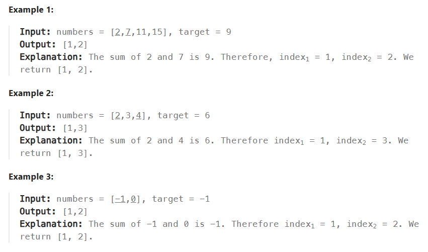
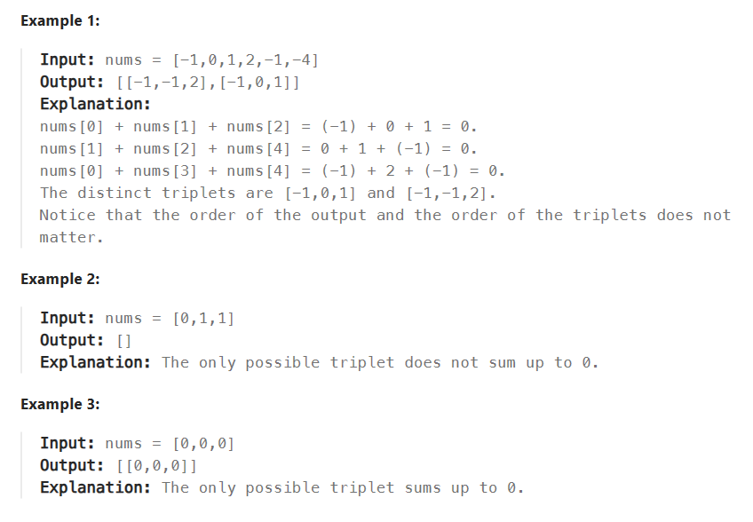

# Two Pointer

# 167TwoSumIIInputArrayIsSorted
>Given a 1-indexed array of integers numbers that is already sorted in non-decreasing order, find two numbers such that they add up to a specific target number. Let these two numbers be numbers[index1] and numbers[index2] where 1 <= index1 < index2 < numbers.length.
Return the indices of the two numbers, index1 and index2, added by one as an integer array [index1, index2] of length 2.
The tests are generated such that there is exactly one solution. You may not use the same element twice.
Your solution must use only constant extra space.


- 前后比较，慢慢趋近中间，如果大于，就要把数目降低，所以右指针移动，如果太小，就要移动左边。

```py
def twoSum(self, numbers, target):
        """
        :type numbers: List[int]
        :type target: int
        :rtype: List[int]
        """
        left = 0
        right = len(numbers) - 1

        while(left<right):
            if(numbers[left]+numbers[right] == target):
                return [left+1, right+1]
            if(numbers[left]+numbers[right]<target):
                left+=1
            else:
                right-=1
```

# 15 3Sum
>Given an integer array nums, return all the triplets [nums[i], nums[j], nums[k]] such that i != j, i != k, and j != k, and nums[i] + nums[j] + nums[k] == 0.
Notice that the solution set must not contain duplicate triplets.
 

 - 只要是重复的都可以跳过！