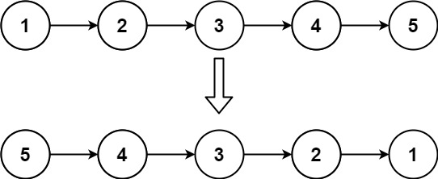
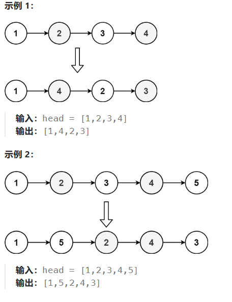
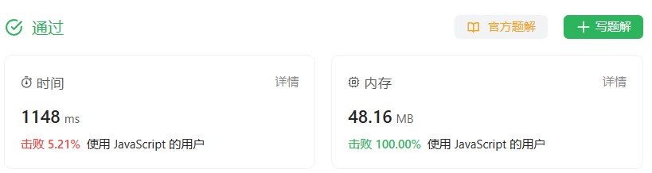

# Linked List

# 206 Reverse Linked List
>给你单链表的头节点 head ，请你反转链表，并返回反转后的链表。

输入：head = [1,2,3,4,5]
输出：[5,4,3,2,1]

## 方法一：使用迭代
1. 本题目每次中到的陷阱就是每次要去读取Null的时候就会报错
2. 解决方法就是在进入下一个循环之前就确定是否为null，并且不要使用会使得读取null的如
```js
while(cur.next) //可能cur.next == null，此时会报错
```
应该使用while(cur)
```js
var reverseList = function(head) {
    let last = null
    let cur = head

    while(cur){
        const next = cur.next
        cur.next = last
        last = cur
        cur = next
    }


    //返回last是因为cur已经是null
    console.log(last)
};
```

## 方法二：递归

# 143 Reorder List
>给定一个单链表 L 的头节点 head ，单链表 L 表示为：
L0 → L1 → … → Ln - 1 → Ln
请将其重新排列后变为：
L0 → Ln → L1 → Ln - 1 → L2 → Ln - 2 → …
不能只是单纯的改变节点内部的值，而是需要实际的进行节点交换。



想法：保存一个数组，每次取最前和最后，然后连接起来，保存尾节点，然后重复完成步骤