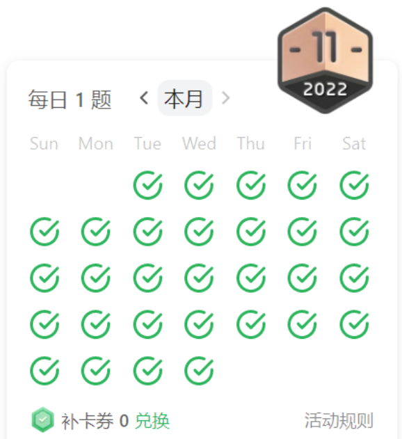

# Using JavaScript to solve Leetcode November 2023
**Why?**
- as a challenge for myself
- help my brain think actively
- persist on something that sees result

**How?**
- Every morning i choose a random question to solve for the day
- Must commit the code at before night `23:00`
- Engage 2-3 hour on this thing

**Reward**
- Get a leetcode medal 
- 噢摸，原来这个勋章是要刷里面的**每日一题**，G了，那么我要鼓励自己去面试吧刷了30天后


## Progress
| 日期  | 题目                   | 难度                     |
| ----- | ---------------------- | ------------------------ |
| 1/11  | 贪心53                 | 中下                     |
| 2/11  | 回溯78                 | 中等                     |
| 3/11  | 回溯29                 | 中等                     |
| 4/11  | 滑动窗口121            | 简单                     |
| 5/11  | 滑动窗口3              | 中等                     |
| 6/11  | 滑动窗口424            | 中上                     |
| 7/11  | 回溯46                 | 中等                     |
| 8/11  | 1D动态规划70           | 简单                     |
| 9/11  | 1D动态规划198          | 中等                     |
| 10/11 | 1D动态规划213          | 中等                     |
| 11/11 | 树110                  | 简单（我觉得不是很简单） |
| 12/11 | 树100                  | 简单（一次过）           |
| 13/11 | 树572                  | 理解后简单               |
| 14/11 | 树235                  | 简单                     |
| 15/11 | 树102                  | 中等                     |
| 16/11 | 链表206                | 简单                     |
| 17/11 | 栈150                  | 中等                     |
| 18/11 | 比特136                | 简单                     |
| 19/11 | 回溯90                 | 中等                     |
| 20/11 | 回溯40                 | 中等                     |
| 21/11 | 回溯70，（回溯78,29）  | 中等                     |
| 22/11 | 树199                  | 中等                     |
| 23/11 | 链表143                | 中等                     |
| 24/11 | 比特191                | 中等                     |
| 25/11 | 比特89（格雷）         | 中等                     |
| 26/11 | 回溯386                | 中等                     |
| 27/11 | 图200，695（一样）,471 | 中等                     |
| 28/11 | 图130，994             | 中等                     |
| 29/11 | 前缀树208              | 中等                     |
| 30/11 | 前缀树211              | 中等                     |

# December 2023 (Using C#)


- 要开始使用`C#`语言编写了！
- 从`4/12`开始使用C#编写了。
- 再vscode创建 C# Console Application方法，创建相应的目录后eg`树1038`然后terminal
```bash
dotnet new console
```
- 运行
```bash
dotnet run
```

| 日期  | 题目                             | 难度 |
| ----- | -------------------------------- | ---- |
| 1/12  | 数组&Map2661                     | 中等 |
| 2/12  | 数组&Map1094，双指针167,15，栈22 | 中等 |
| 3/12  | 滑动窗口1423                     | 中等 |
| 4/12  | 树1038                           | 中等 |
| 5/12  | 树2477                           | 中等 |
| 6/12  | 动态规划2646                     | 困难 |
| 7/12  | 动态规划337, 树1466              | 中等 |
| 8/12  |                                  |      |
| 9/12  |                                  |      |
| 10/12 |                                  |      |