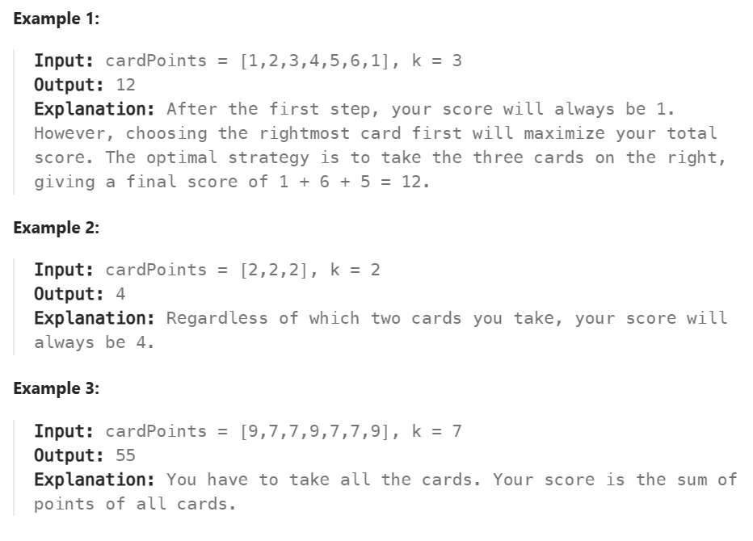

# SlidingWindow
-  reusing the loops gets reduced
-  reuse the result of the previous step to compute the result of the next step


# 78 Best time to buy and sell stock
重点就是左右指针的使用，这个是dynamic window size，因为窗口大小不是固定的

```js
 while(right<prices.length-1){
        console.log("right:"+right + " :" + prices[right] +" left:" + left+ " :" + prices[left] )
        nextValue = prices[++right]

        if(prices[left]>nextValue){
            left = right
        }
        
        // console.log(nextValue)
        diff = Math.max((nextValue - prices[left]),diff)
    }
```

# 3 Longest Substring Without Repeating Characters	
1. 第一个解法肯定不怎么好，因为每次要从头到尾寻找有没有冲突的，这样子时间一定满
2. 瞄了一眼，可以用Javascript提供的SET来解这一题（试试看）

精髓依然是leftpointer和rightpointer
然后利用**SET**来收集只有单个同样字符的集合比如：{a,b,c}就是一个set，{a,b,c,c}不是一个set

```js
    let mySet = new Set()
    let l = 0
    let longestSubString=0

    for(let r = 0; r<s.length;r++){
        while(mySet.has(s[r])){
            mySet.delete(s[l++])
        }

        mySet.add(s[r])
        
        longestSubString = (longestSubString <= (mySet.size))? mySet.size:longestSubString
    }

    return longestSubString
    
```

# 424 Longest Repeating Character Replacement
>// 给你一个字符串 s 和一个整数 k 。你可以选择字符串中的任一字符，并将其更改为任何其他大写英文字符。该操作最多可执行 k 次。
// 在执行上述操作后，返回 包含相同字母的最长子字符串的长度。
// 示例 1：
// 输入：s = "ABAB", k = 2
// 输出：4
// 解释：用两个'A'替换为两个'B',反之亦然。
// 示例 2：
// 输入：s = "AABABBA", k = 1
// 输出：4
// 解释：
// 将中间的一个'A'替换为'B',字符串变为 "AABBBBA"。
// 子串 "BBBB" 有最长重复字母, 答案为 4。
// 可能存在其他的方法来得到同样的结果。

如何总结 - 写之前要好好去思考才开始写，不然就是在浪费时间。
学到的方法：
```js
let myMap = new Map()

//遍历查找myMap的方法
let max = Math.max(...myMap.values())
```

1. 先把新数据加进去map
2. $窗口大小 - map内最大的value > k$ 的话就将左指针移动
3. 算取窗口大小

# 1423 Maximum Points You Can Obtain from Cards
>There are several cards arranged in a row, and each card has an associated number of points. The points are given in the integer array cardPoints.
In one step, you can take one card from the beginning or from the end of the row. You have to take exactly k cards.
Your score is the sum of the points of the cards you have taken.
Given the integer array cardPoints and the integer k, return the maximum score you can obtain.


ask to get from front and end, can use sliding windows becuase it is a section(**连续的**)