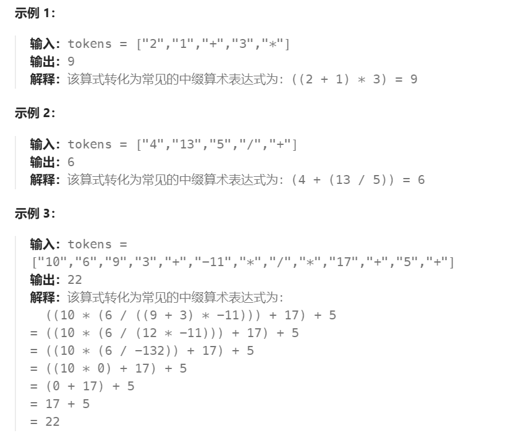
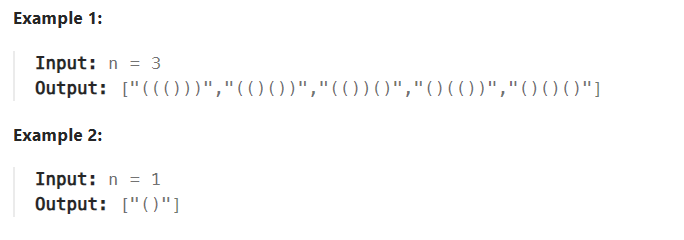
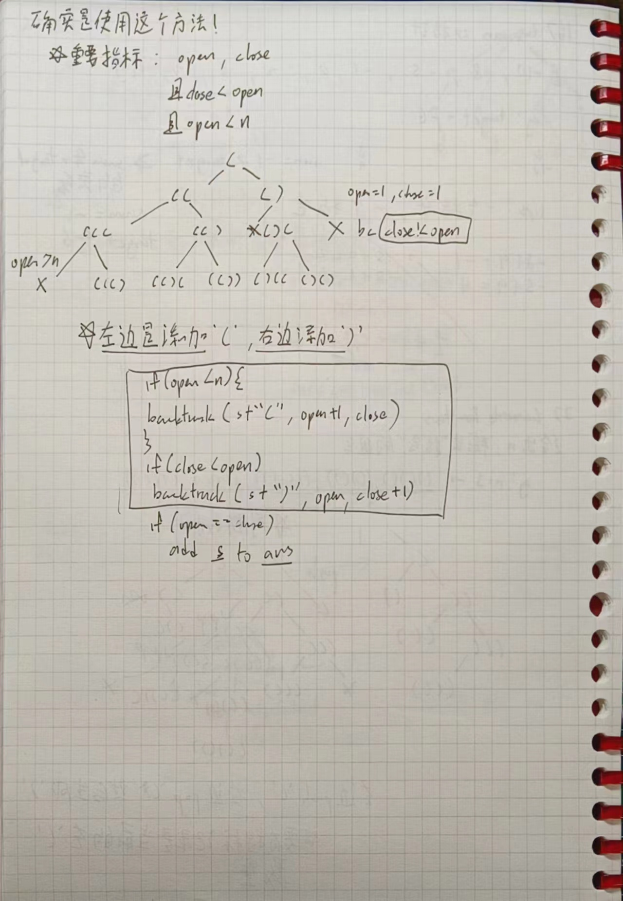
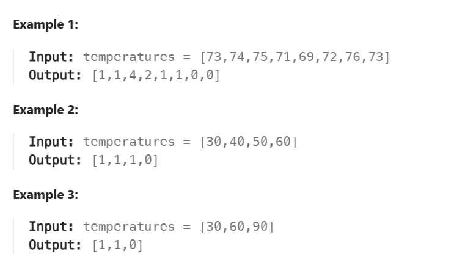

# Stack

# 150 Reverse Polish Notation
>给你一个字符串数组 tokens ，表示一个根据 逆波兰表示法 表示的算术表达式。
请你计算该表达式。返回一个表示表达式值的整数。
注意：
有效的算符为 '+'、'-'、'*' 和 '/' 。
每个操作数（运算对象）都可以是一个整数或者另一个表达式。
两个整数之间的除法总是 向零截断 。
表达式中不含除零运算。
输入是一个根据逆波兰表示法表示的算术表达式。
答案及所有中间计算结果可以用 32 位 整数表示

- 注意取整数的方向，以及用到的`string`转`int`
```js
parseInt("String")
```

# 22 Generate Parentheses
>Given n pairs of parentheses, write a function to generate all combinations of well-formed parentheses.




This question more like backtracking, but stack also used in here

important code~~

`open`
`close`

```py
def backtrack(open,close):
    if(open == close == n)
        ans.append("".join(stack))
        # 退回
        return

    # 开括号
    if(open<n):
        stack.append("(")
        backtrack(open+1,close)
        stack.pop()

    if(close<open):
        stack.append(")")
        backtrack(open,close+1)
        stack.pop()
```

# C# Section

# 739 Daily Temperatures
>Given an array of integers temperatures represents the daily temperatures, return an array answer such that answer[i] is the number of days you have to wait after the ith day to get a warmer temperature. If there is no future day for which this is possible, keep answer[i] == 0 instead.

