# Tree

# 110 Balanced Binary Tree
给定一个二叉树，判断它是否是高度平衡的二叉树。
本题中，一棵高度平衡二叉树定义为：

>一个二叉树每个节点 的左右两个子树的高度差的绝对值不超过 1 。
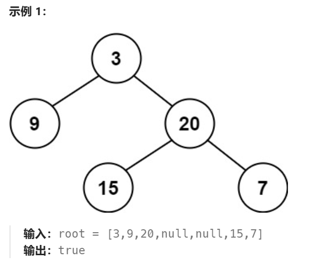


这题我首先用的方法是递归，想法确实没有问题，但是我在做递归方面需要非常理解每一次的**返回值**以及他的**终止条件**

- 对于这一题，我们为了得到是否为平衡树，其实就是需要直到**左右子树的高度差**，并且我们直到终止条件吗？有！就是当节点为`null`的时候，他的高度就为`0`，就有以下的代码

```js

function dfs(node){
    //当为叶子节点的左右节点时
    if(node == null){
        //返回树的高度
        return 0
    }

    let leftHeight = dfs(node.left)
    if(leftHeight == -1){
        return -1
    }

    let rightHeight = dfs(node.right)
    if(rightHeight == -1){
        return -1
    }


    //当左右子树的高度差小于1时
    let isNotBalanced = (Math.abs(leftHeight - rightHeight) > 1)

    if(isNotBalanced){
        return -1
    }

    return Math.max(leftHeight, rightHeight) + 1 
}

```

# 100 Same Tree
给你两棵二叉树的根节点 p 和 q ，编写一个函数来检验这两棵树是否相同。
如果两个树在结构上相同，并且节点具有相同的值，则认为它们是相同的。
>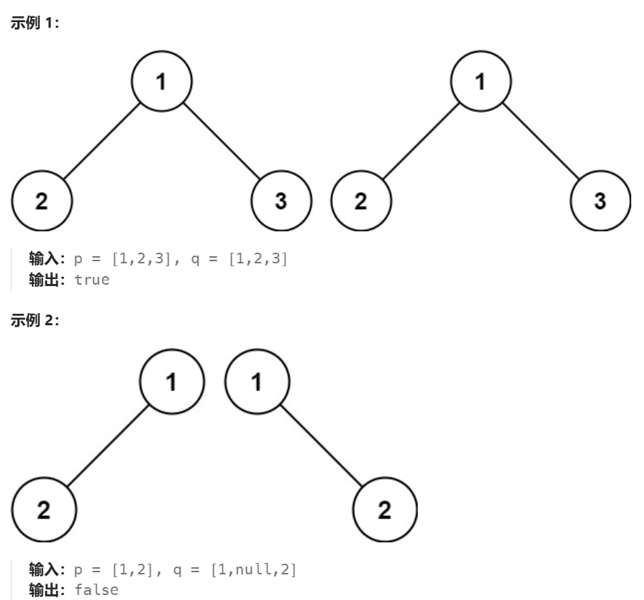
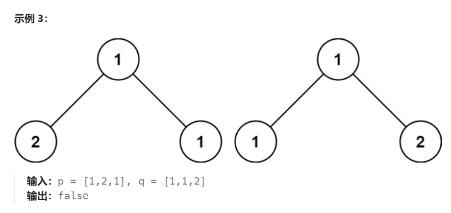

想想终止条件
1. 就是他们的val不一样的时候就可以返回-1了
2. 还有就是当其中一个为null也是返回-1代表不同样
3. 只有当所有都通过了才是正确的

# 572 Subtree of another tree
给你两棵二叉树 root 和 subRoot 。检验 root 中是否包含和 subRoot 具有相同结构和节点值的子树。如果存在，返回 true ；否则，返回 false 。

二叉树 tree 的一棵子树包括 tree 的某个节点和这个节点的所有后代节点。tree 也可以看做它自身的一棵子树。
>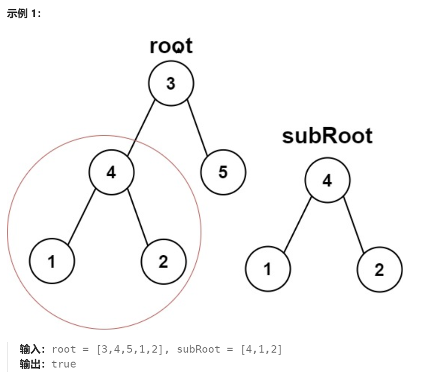
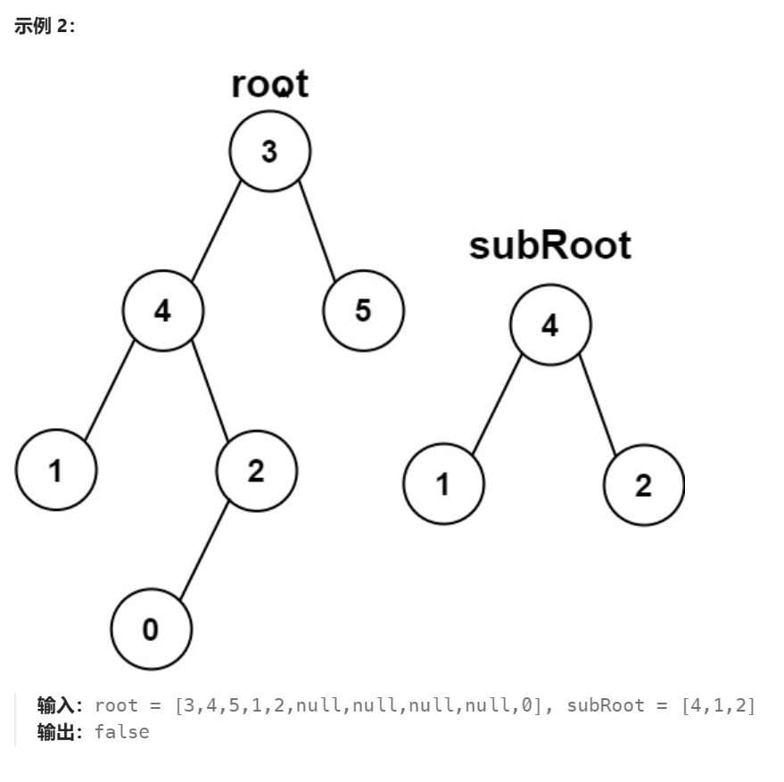
 
 Edge cases
 1. 1 null-null - true
 2. Main null - false
 3. Sub null - true

```js
function isSubTree(root,subRoot){
    if(root == null){
        return false
    }

    if(isSameTree(root,subRoot)){
        return true
    }

    return isSameTree(root.left, subRoot.left) || isSameTree(root.right, subRoot.right)
}

function isSameTree(root, subRoost){
    if(root == null && subRoot == null)
        return true;

    if(root && subRoot && root.val == subRoot.val)
        return isSameTree(root.left, subRoot.left) && isSameTree(root.right && subRoot.right)

    return false
}
```

# 235 Lowest Common Ancestor of a Binary Search Tree
给定一个二叉搜索树, 找到该树中两个指定节点的最近公共祖先。

百度百科中最近公共祖先的定义为：“对于有根树 T 的两个结点 p、q，最近公共祖先表示为一个结点 x **，满足 x 是 p、q 的祖先且 x 的深度尽可能大**（一个节点也可以是它自己的祖先）。”

注意看-他是一个平衡二叉树，左边小于节点，有边大于节点
1. 当当前节点大于p，q，则最近的祖先一定再当前节点的**左边**
2. 当当前节点比p,q都小，则最近的祖先一定再当前节点的**右边**
3. 如果当前节点刚好处于中间的位置，那么当前节点就是q,p的最近公共祖先


例如，给定如下二叉搜索树:  root = [6,2,8,0,4,7,9,null,null,3,5]
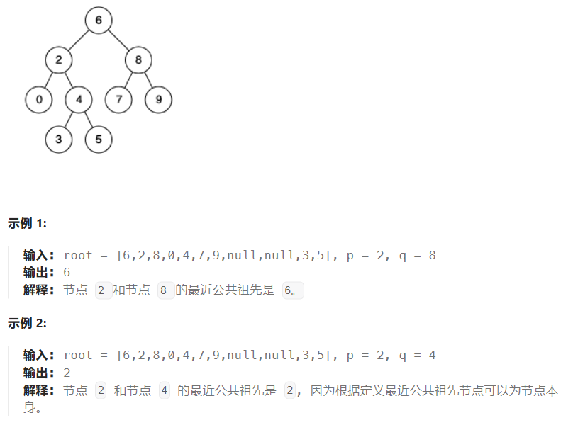

```js
    if(root.val > p.val && root.val > q.val){
        return lowestCommonAncestor(root.left,p,q)
    }

    if(root.val < p.val && root.val < q.val){
        return lowestCommonAncestor(root.right,p,q)
    }

    return root
```

# 102 Level-Traverse binary tree
给你二叉树的根节点 root ，返回其节点值的 层序遍历 。 （即逐层地，从左到右访问所有节点）。
>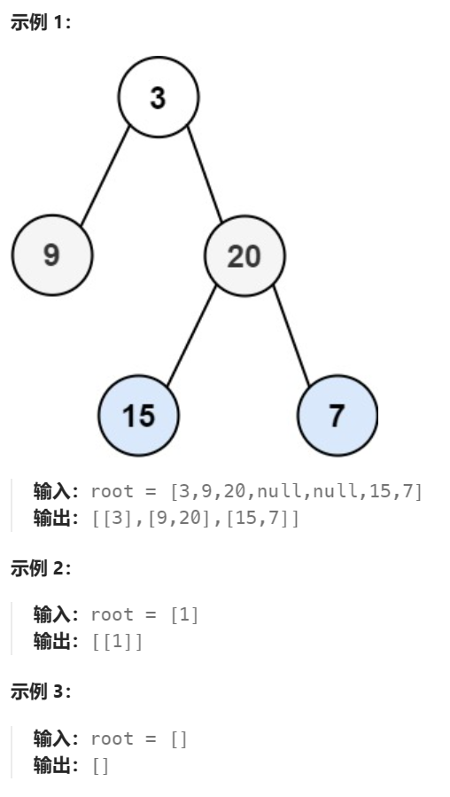
 
level traverse 可以使用stack，每进一个就推新的进来

# 199 BinaryTreeRightSideView
>给定一个二叉树的 根节点 root，想象自己站在它的右侧，按照从顶部到底部的顺序，返回从右侧所能看到的节点值。
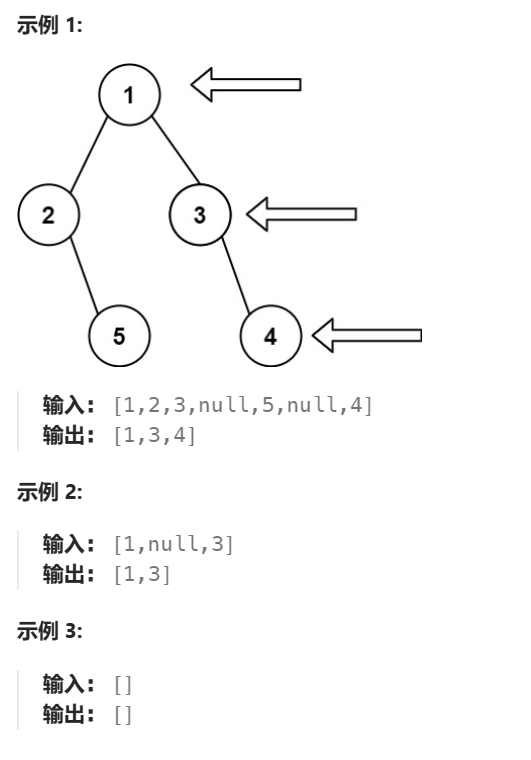

方法就是利用Level Traverse获取最右边的数值
其中level Traverse的方法用queue

# C# sections
# 1038 Binary Search Tree to Greater Sum Tree
>Given the root of a Binary Search Tree (BST), convert it to a Greater Tree such that every key of the original BST is changed to the original key plus the sum of all keys greater than the original key in BST.
As a reminder, a binary search tree is a tree that satisfies these constraints:
The left subtree of a node contains only nodes with keys less than the node's key.
The right subtree of a node contains only nodes with keys greater than the node's key.
Both the left and right subtrees must also be binary search trees.
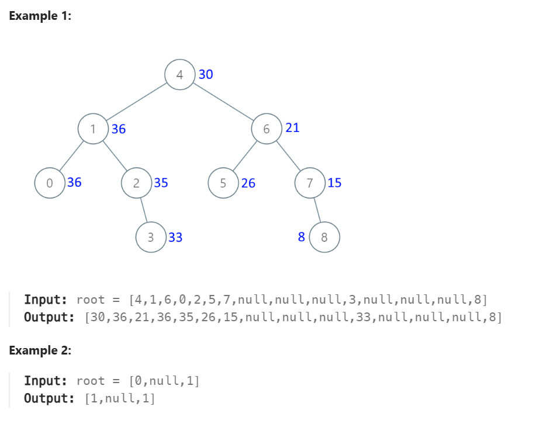

# 2477 Minimum Fuel Cost to Report to the Capital
>There is a tree (i.e., a connected, undirected graph with no cycles) structure country network consisting of n cities numbered from 0 to n - 1 and exactly n - 1 roads. The capital city is city 0. You are given a 2D integer array roads where roads[i] = [ai, bi] denotes that there exists a bidirectional road connecting cities ai and bi.
There is a meeting for the representatives of each city. The meeting is in the capital city.
There is a car in each city. You are given an integer seats that indicates the number of seats in each car.
A representative can use the car in their city to travel or change the car and ride with another representative. The cost of traveling between two cities is one liter of fuel.
Return the minimum number of liters of fuel to reach the capital city.
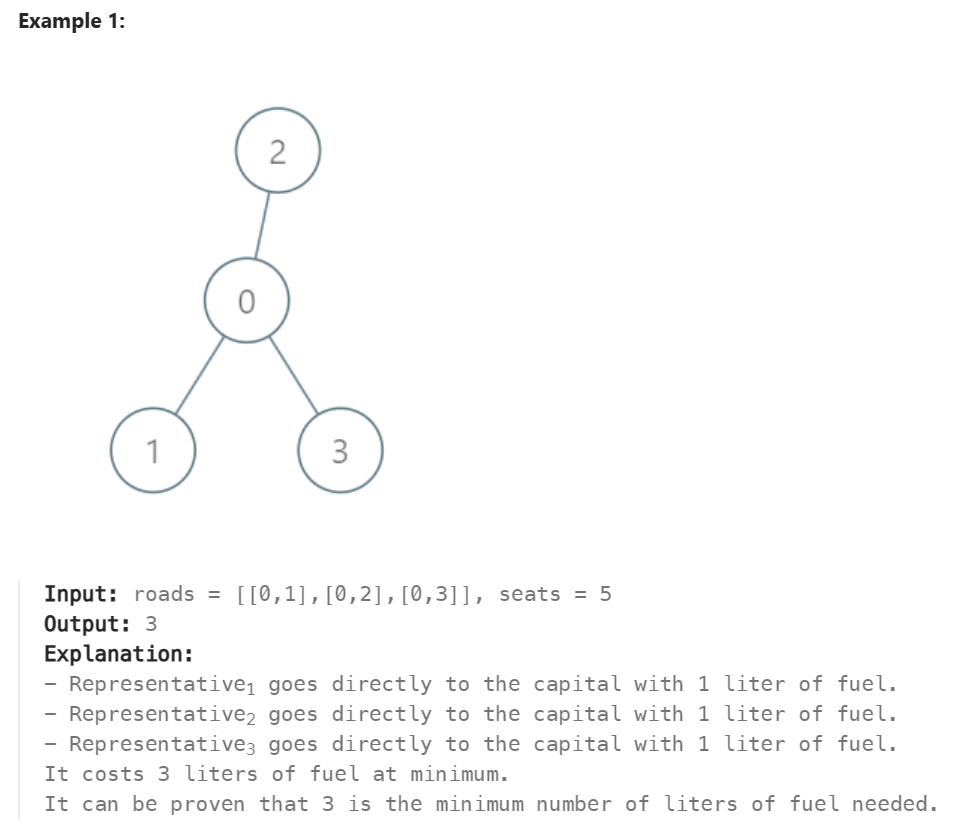
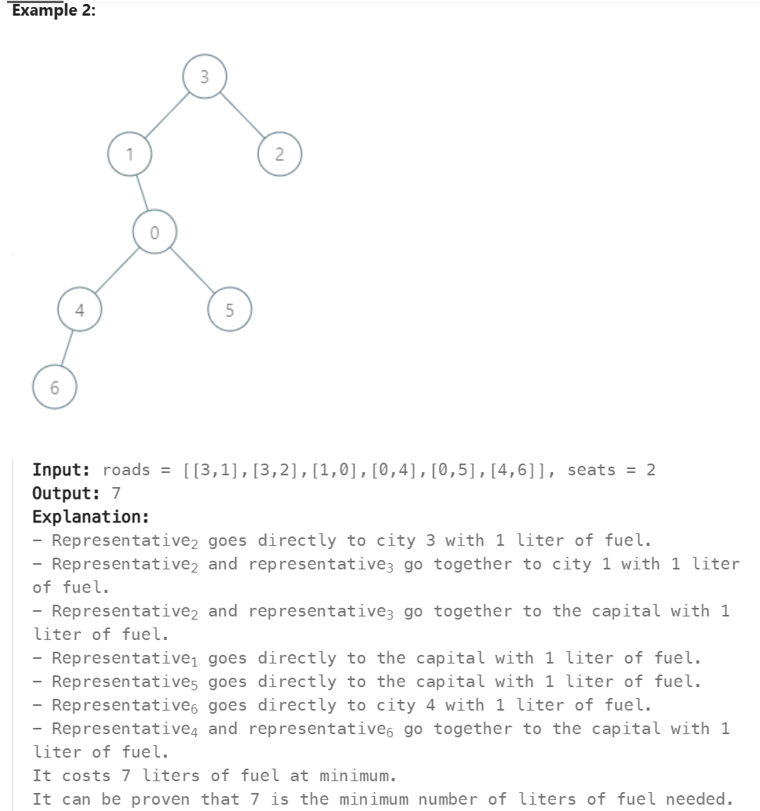
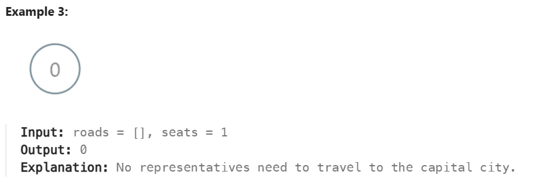

今天第一次用C#使用`List`数据类型，他的数据类型List也是跟js的Array一样，可以`Add()`函数等等，然后查找可以使用`list[0]`类似的方法。

那么来讨论以下这一题的难点吧：
1. 首先我们获取的数组是`无向`的，也就是说节点0到1可以写成[0,1]或[1,0]都无所谓。
   1. 解决办法为使用`List<List<int>>`保存key和value
   2. 然后利用`visited[]`来记录，哪一个key已经被访问过了，那么就可以解决双向的问题。
2. 第二个点就是怎么计算**燃油费用**，遍历到树的结尾，因为每过一条路就需要**燃油+1**，然后就是考虑人数和汽车能够载的人数，推出`fuel += (people + seats -1)/seats`，假设当前节点有**3**个人，汽车能载**2**个人，那么fuel = (3+2-1)/2 = 2，则需要两辆车才能够载送3个人，所以**燃油费为2**

# Starting in C#

# 1466. Reorder Routes to Make All Paths Lead to the City Zero
>There are n cities numbered from 0 to n - 1 and n - 1 roads such that there is only one way to travel between two different cities (this network form a tree). Last year, The ministry of transport decided to orient the roads in one direction because they are too narrow.
Roads are represented by connections where connections[i] = [ai, bi] represents a road from city ai to city bi.
This year, there will be a big event in the capital (city 0), and many people want to travel to this city.
Your task consists of reorienting some roads such that each city can visit the city 0. Return the minimum number of edges changed.
It's guaranteed that each city can reach city 0 after reorder.
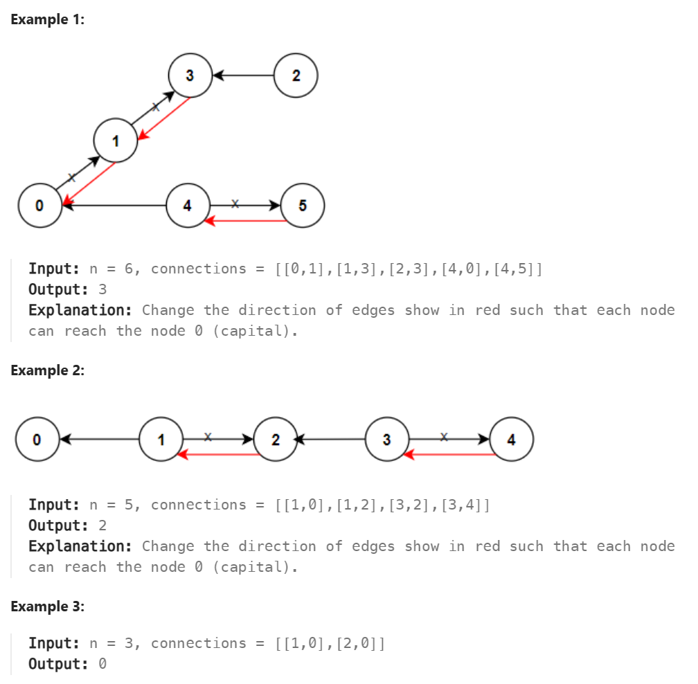

解题方法一样为从数组变成树，方法就是遍历数组，生成一个key value形式的保存，但由于这一题
1. 他是单向的（所以需要记录他的走向）
2. 什么时候需要`+1`
3. 如何去遍历（深度搜索/广度搜索都可以，重点就是走完整棵树就可以了）

>再C#这里，由于我们要保存的形式如下
connection:[[0,1],[2,0]]
[0] -> [1,true],[2,false]
其中表示，0->1需要反转，0->2不需要反转

新学习几样C#的数据结构
1. IList
2. Tuple
```cs
IList<Tuple<int,int>> Arr2d[] = new IList<Tuple<int,int>>[n];

for(int i = 0; i<n;i++){
    Arr2d[i] = new List<Tuple<int,int>>();
}

foreach(int[] edge in connections){
    
}
```