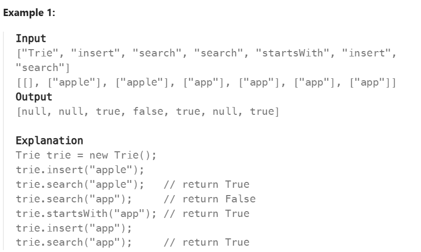
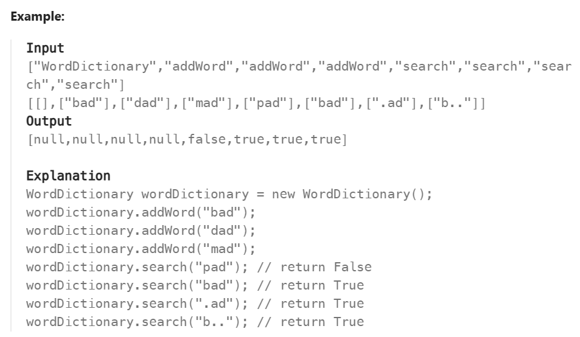

# Tries
>A 'prefix tree', it is mostly used on word matching, like our search engine that will predict what words we will input next based on what it have

Data Structure
TriesNode
- TriesNode[26]: <char>Array （26 means for 26 other alphabet）
- isEndOfWord: Boolean
- prefix （以该字母为前缀的数量）

Methods
- insert
- search
- startsWith

# 208 Implement Tries
>A trie (pronounced as "try") or prefix tree is a tree data structure used to efficiently store and retrieve keys in a dataset of strings. There are various applications of this data structure, such as autocomplete and spellchecker.
Implement the Trie class:
Trie() Initializes the trie object.
void insert(String word) Inserts the string word into the trie.
boolean search(String word) Returns true if the string word is in the trie (i.e., was inserted before), and false otherwise.
boolean startsWith(String prefix) Returns true if there is a previously inserted string word that has the prefix prefix, and false otherwise.


基本的操作不会难，不过可以利用set来代替直接生成空间为26的array。
```py
    def __init__(self):
    self.root = TrieNode()


    def insert(self, word):
        cur = self.root

        for c in word:
            if(c not in cur.children):
                cur.children[c] = TrieNode()
            cur = cur.children[c]

        cur.isEndOfWord = True


    def search(self, word):
        cur = self.root

        for c in word:
            if(c not in cur.children):
                return False
            cur = cur.children[c]
        
        return cur.isEndOfWord


    def startsWith(self, prefix):
        cur = self.root

        for c in prefix:
            if(c not in cur.children):
                return False
            cur = cur.children[c]

        return True
```

# 211 Design Add and Search Words Data Structure
>Design a data structure that supports adding new words and finding if a string matches any previously added string.
Implement the WordDictionary class:
WordDictionary() Initializes the object.
void addWord(word) Adds word to the data structure, it can be matched later.
bool search(word) Returns true if there is any string in the data structure that matches word or false otherwise. word may contain dots '.' where dots can be matched with any letter.

