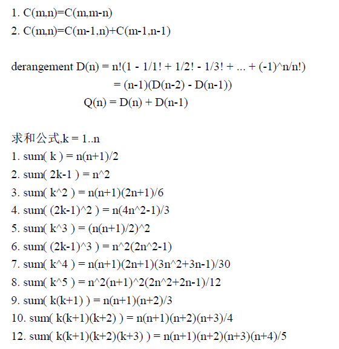

# Combination



# 2.2 Genrerate Permutaion and Combination
>//gen_perm 产生字典序排列P(n,m)
//gen_comb 产生字典序组合C(n,m)
//gen_perm_swap 产生相邻位对换全排列P(n,n)
//产生元素用1..n 表示
//dummy 为产生后调用的函数,传入a[]和n,a[0]..a[n-1]为一次产生的结果
 #define MAXN 100
 int count;

## 1. gen_ perm
- use backtracking as always for combination and permutation
- and for this, the ending condition is when it reaches the floor, in this case it is the `m`.

 ```python
 # need to return the array of permutation eg: {ABC,BCA,CAB,...}
def gen_perm(n,m):

    curLev = 0
    path = []
    tag = [0] * 100

    return gen_perm_backtrack(curLev,n,m,path,tag)

def gen_perm_backtrack(curLev,n,m,path,tag):
    if(curLev == m):
        #print the path 
        print(path)
        return path

    for i in range(n):
        # 如果不属于在里面的
        if(not tag[i]):
            path.append(i+1)
            tag[i] = 1
            gen_perm_backtrack(curLev+1,n,m,path,tag)
            path.pop()
            tag[i] = 0

def main():
    ans = gen_perm(3,2)
 ```


## 2. gen_comb
```python
def gen_comb(n,m):
    
    curLev = 0
    path = []
    startIndex = 0
    
    return gen_comb_backtrack(curLev,n,m,path,startIndex)

def gen_comb_backtrack(curLev,n,m,path,startIndex):

    if(curLev == m):
        print(path)
        return

    for i in range(startIndex,n):
        path.append(i+1)
        gen_comb_backtrack(curLev+1,n,m,path,i+1)
        path.pop()

def main():
    gen_comb(3,2)
```


组合问题比较简单，就是startIndex需要更改以下。

## gen_perm_swap 另一种方式生成排列（SJT algorithm）
- 产生相邻位对换全排列P(n,n)
- Steinhaus–Johnson–Trotter algorithm


# 2.3 生成gray码
>//生成reflected gray code
//每次调用gray 取得下一个码
//000...000 是第一个码,100...000 是最后一个码

就是找规律而已，还行，看看清华的解法吧。。
```js
    let ans = new Array()
    ans.push(0)
    ans.push(1)

    if(n===1){
        return ans
    }

    for(i=2;i<=n;i++){
        for(j = ans.length-1; j>=0;j--){
            ans.push(ans[j] + Math.pow(2,i-1))
        }
    }

    return ans
```

